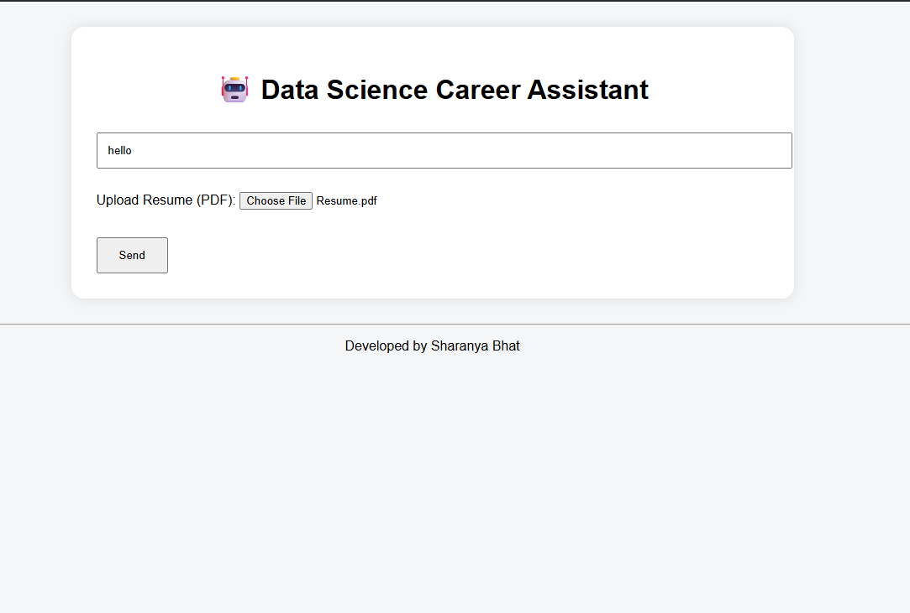
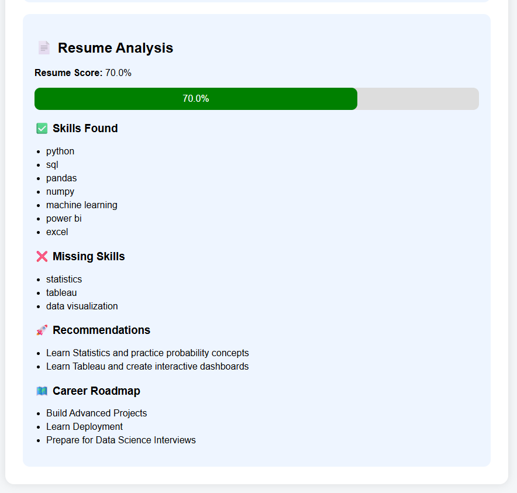

# AI-Powered Data Science Career Assistant

## Overview

A Machine Learning and NLP-powered web application that helps aspiring Data Scientists analyze resumes, identify skill gaps, receive personalized recommendations, and interact with an intelligent career guidance chatbot.

## Features

* NLP Chatbot using TF-IDF and Logistic Regression
* Resume Upload and PDF Parsing
* Skill Detection
* Missing Skill Analysis
* Resume Score Calculation
* Personalized Recommendations
* Career Roadmap Generation
* Flask-Based Web Application

## Technologies Used

* Python
* Flask
* Scikit-Learn
* TF-IDF
* Logistic Regression
* PDFPlumber
* HTML
* CSS

## Screenshots

### Home Page

### Resume Analysis

## Live Demo:
https://ai-powered-data-science-career-assistant.onrender.com/

## Developed By

Sharanya Bhat

